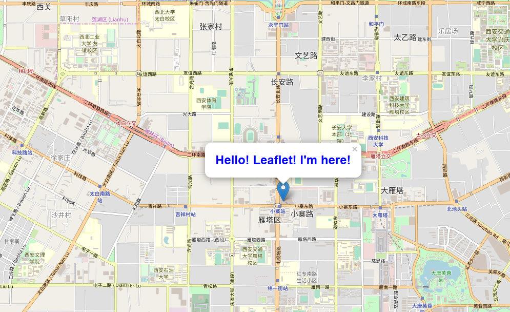

# leaflet study 2.html
这是一个非常简单例子，用来展示编辑图层，在指定的`维度，经度`上图层添加一个标记和popup事件。 
Add a marker and a popup event.

## 使用步骤
> 1. 向图层添加一个标记和popup事件
```
//在指定的[维度，经度]上添加一个标记（marker）
var maker = L.marker([34.225028,108.942963])
    //添加Popup事件。当鼠标点击时候显示“Hello! Leaflet! I'm here!”
    .bindPopup("<div style="+'"color:#0000FF"'+"><h1>Hello! Leaflet! I'm here!</h1></div>")
    .addTo(map);
```

## 示例图

