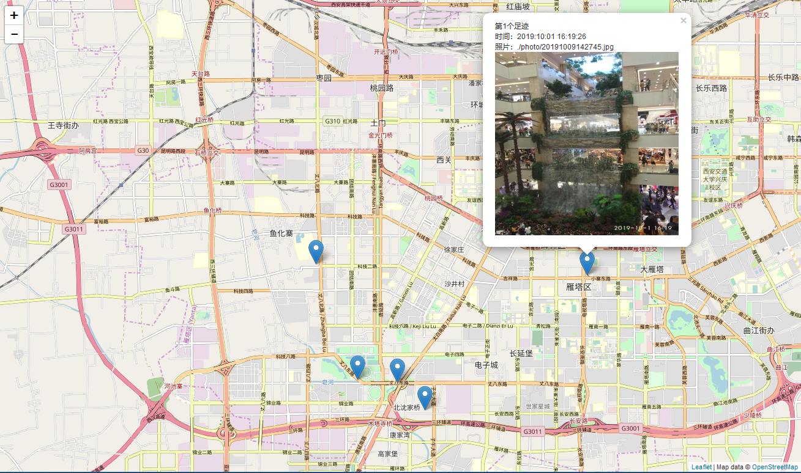

# leaflet study 3.html
这是一个例子，将一批gps情报标到地图上。 
Mark the GPS information on map.

## 使用步骤
> 1. 使用 [解析照片gps信息工具](https://github.com/mutou8bit/PhotoMap/blob/master/getExifData.py) 输出 `./photo/`文件夹下所有照片的gps信息。

> 2. 根据第1步得到的gps信息创建 `gps-info.js`文件。
```
var gpsPoints = [['20191009142745.jpg', '2019:10:01 16:19:26', 108.942963, 34.225028], ['201910091429045.jpg', '2019:10:02 12:04:23', 108.86703197222222, 34.227606972222226], ['201910091429043.jpg', '2019:10:02 12:16:31', 108.87864397222222, 34.200721], ['201910091429042.jpg', '2019:10:02 12:20:43', 108.88984497222224, 34.200046972222225], ['201910091429041.jpg', '2019:10:02 12:40:43', 108.89755397222223, 34.193619999999996], ['20191009142904.jpg', '2019:10:03 14:05:18', 107.37499299999999, 33.173182999999995]];
```

> 3. 使用 [照片缩小工具](https://github.com/mutou8bit/PhotoMap/blob/master/resize.py) 压缩 `./photo/`文件夹下所有照片，输出到 `./resize/` 文件夹下。

> 4. 读出 `gps-info.js`中的gps信息，批量标记到地图上。

## 示例图


