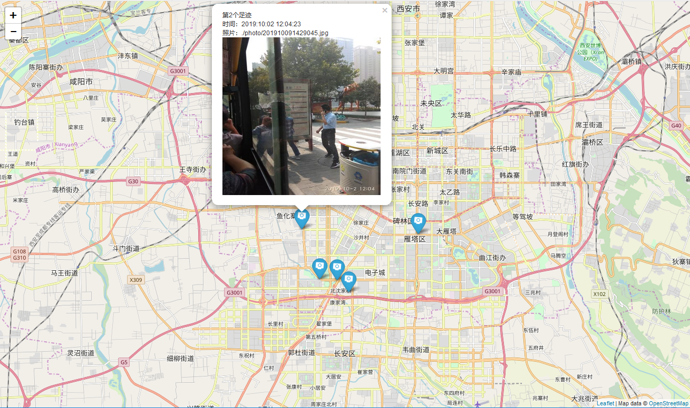

# leaflet study 4.html
这是一个使用 [Leaflet.awesome-markers](https://github.com/lvoogdt/Leaflet.awesome-markers)库，自定义标记(marker)的例子。 
Custom marker.

## 使用步骤
> 1. 参照 Leaflet.awesome-markers 的 [Using the plugin](https://github.com/lvoogdt/Leaflet.awesome-markers)  
>> 引入 font-awesome的CSS
```
<link href="http://netdna.bootstrapcdn.com/font-awesome/4.0.0/css/font-awesome.css" rel="stylesheet">
```

>> 拷贝 Leaflet.awesome-markers的dist文件夹到项目工程中

>> 引入 Leaflet.awesome-markers的css和js
```
<link rel="stylesheet" href="./dist/leaflet.awesome-markers.css">
<script src="./dist/leaflet.awesome-markers.js"></script>
```

> 2. 在添加marker时候使用 awesome-markers库
```
var marker = L.marker([a[3], a[2]], { icon: L.AwesomeMarkers.icon({ icon: 'camera', prefix: 'fa', markerColor: 'blue', spin:true }) })
	//添加Popup事件。当鼠标点击时候显示。
	marker.bindPopup(sucontents);
	marker.addTo(map);
```

## 示例图

