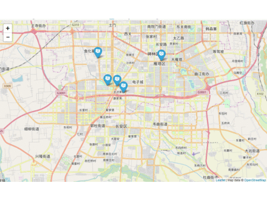

# leaflet-study
leaflet study notes. leaflet学习笔记。

#### [1.基本使用](./1/Readme.md )

#### [2.添加一个标记,并且给标记添加Popup事件](./1/Readme.md )

#### [3.根据gps数据批量添加标记，并给每个标记的Popup事件添加一个缩略图](./3/Readme.md )

#### [4.自定义标记符号 (使用Leaflet.awesome-markers库)](./3/Readme.md )  

### 示例图
